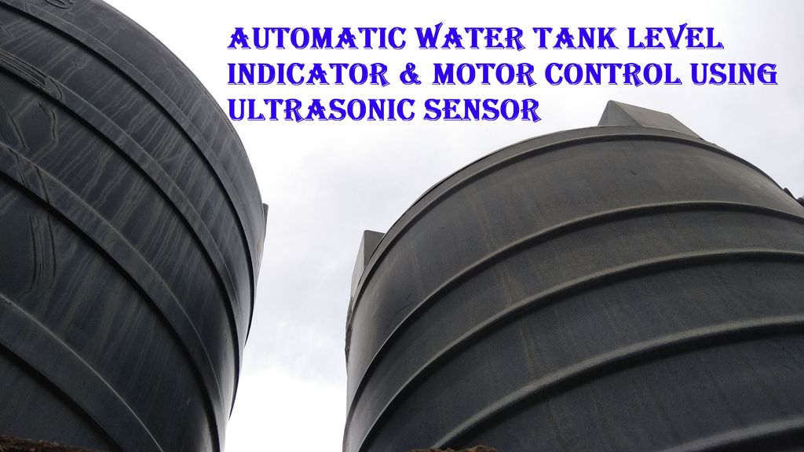
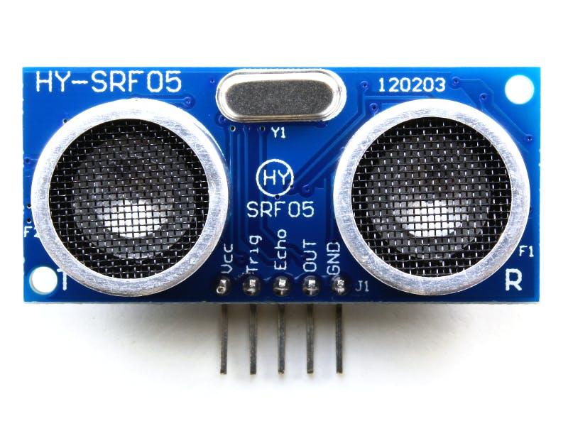

# <h1>Water-Motor-Control-With-Ultrasonic-Sensor</h1>
On/Off water motor automatically based on the water level in the water tank given by ultrasonic sensor.

<h2>About this Project</h2>

This project is a about a fully functional water level controller using Arduino and Ultrasonic sensor. The Ultrasonic sensor calculate level of water in the tank and switches the motor ON when the water level goes below a predetermined level. The circuit automatically switches the motor OFF when the tank is full. The circuit also monitors the level of water in the sump tank (source tank).

<h2>Requirements</h2>
<h3>Hardware</h3>
<ol>
  <li>Arduino Uno</li>
  <li>Ultrasonic Sensor 5v</li>
  <li>Relay</li>
  <li>Jumper Wires</li>
  <li>Water Motor</li>
</ol>
<h3>Software</h3>
<ol>
  <li>Arduino IDE</li>
  <li>Source Program for ultrasonic sensor and motor control</li>
</ol>

<h2>Description</h2>
<h3>Ultrasonic Sensor</h3>

An ultrasonic sensor is an electronic device that measures the distance of a target object by emitting ultrasonic sound waves, and converts the reflected sound into an electrical signal. Ultrasonic waves travel faster than the speed of audible sound (i.e. the sound that humans can hear).

