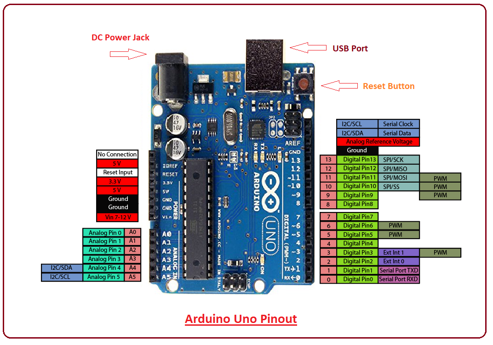
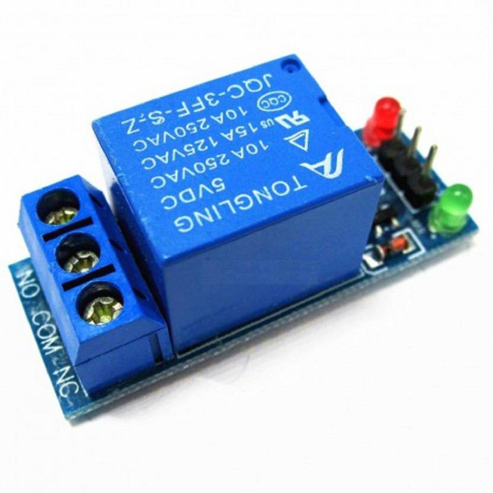
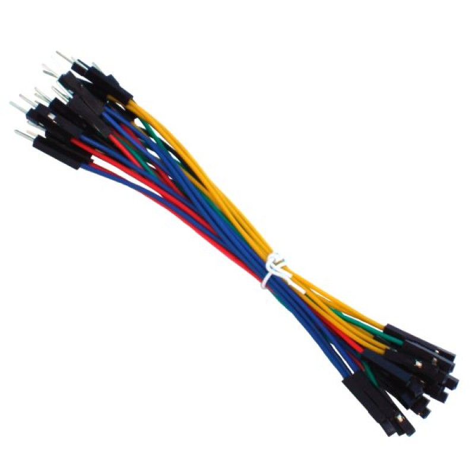
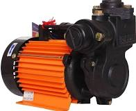

# <h1>Water-Motor-Control-With-Ultrasonic-Sensor</h1>
On/Off water motor automatically based on the water level in the water tank given by ultrasonic sensor.

<h2>About this Project</h2>

This project is a about a fully functional water level controller using Arduino and Ultrasonic sensor. The Ultrasonic sensor calculate level of water in the tank and switches the motor ON when the water level goes below a predetermined level. The circuit automatically switches the motor OFF when the tank is full. The circuit also monitors the level of water in the sump tank (source tank).

<h2>Requirements</h2>
<h3>Hardware</h3>
<ol>
  <li>Arduino Uno</li>
  <li>HC-SR04 Ultrasonic Sensor 5v</li>
  <li>Relay</li>
  <li>Jumper Wires</li>
  <li>Water Motor</li>
</ol>
<h3>Software</h3>
<ol>
  <li>Arduino IDE</li>
  <li>Source Program for ultrasonic sensor and motor control</li>
</ol>

<h2>Description</h2>
<h3>Arduino IDE</h3>

The open-source Arduino Software (IDE) makes it easy to write code and upload it to the board. It runs on Windows, Mac OS X, and Linux. The environment is written in Java and based on Processing and other open-source software. 

<h3>Source Program for ultrasonic sensor and motor control</h3>

  <pre>
//------------polarao-------
///----self water motor control-----------

const int trigPin = 9;
const int echoPin = 10;
const int motor=12;
// defines variables
long duration;
int distance;
void setup() {
pinMode(motor, OUTPUT);  
digitalWrite(motor,LOW);
pinMode(trigPin, OUTPUT); // Sets the trigPin as an Output
pinMode(echoPin, INPUT); // Sets the echoPin as an Input
Serial.begin(9600); // Starts the serial communication
}
void loop() {
// Clears the trigPin
digitalWrite(trigPin, LOW);
delayMicroseconds(2);
// Sets the trigPin on HIGH state for 10 micro seconds
digitalWrite(trigPin, HIGH);
delayMicroseconds(10);
digitalWrite(trigPin, LOW);
// Reads the echoPin, returns the sound wave travel time in microseconds
duration = pulseIn(echoPin, HIGH);
// Calculating the distance
distance= duration*0.034/2;
// Prints the distance on the Serial Monitor
Serial.print("Distance: ");
Serial.println(distance);
if(distance<=30){
   digitalWrite(motor,LOW);
  }
else if(distance>=95){
  digitalWrite(motor,HIGH);
  }
  //104 cm water tank 1000 liters 
}  </pre>

<h3>Arduino UNO</h3>

The Arduino Uno is a microcontroller board based on the ATmega328. It has 20 digital input/output pins (of which 6 can be used as PWM outputs and 6 can be used as analog inputs), a 16 MHz resonator, a USB connection, a power jack, an in-circuit system programming (ICSP) header, and a reset button.

<h3>HC-SR04 Ultrasonic Sensor 5v</h3>

An ultrasonic sensor is an electronic device that measures the distance of a target object by emitting ultrasonic sound waves, and converts the reflected sound into an electrical signal. Ultrasonic waves travel faster than the speed of audible sound (i.e. the sound that humans can hear).

<h3>Relay</h3>

A relay is an electromagnetic switch operated by a relatively small electric current that can turn on or off a much larger electric current. The heart of a relay is an electromagnet (a coil of wire that becomes a temporary magnet when electricity flows through it).

<h3>Jumper Wires</h3>

The term "jumper wire" simply refers to a conducting wire that establishes an electrical connection between two points in a circuit. You can use jumper wires to modify a circuit or to diagnose problems in a circuit.

<h3>Water motor</h3>

